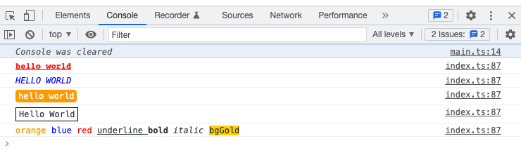

# comelog

 

Comely style logs for the browser.



# Features

- 🚀 Flexible API
- 🌈 Beutifal style
- 🦄 Tiny and no dependencies
- ✨ Support css style

# Install

```shell
npm i comelog -D
```

or

```shell
pnpm add comelog -D
```

# Basic Use

```javascript
import { comelog } from "comelog";

comelog.bold().red().flush("hello world");
comelog.bgOrange().text("bk orange").underline().flush("undeline");
```

# API

Chain styles to use for the string argument with text or flush function. The next to each other style function will be merged. For example, `comelog.red().bold().text("value 1").bgRed().flush("value 2")` will print `value 1` with red and bold style. And the `value 2` has red background.

The `flush` must appear last in the chain.

Comelog supports some preset API. `info`, `warn`, and `error` are easy to use. And these APIs must appear last in the chain because they invoke the `flush` API.

## `info`

```js
comelog.info("I am info.");
```


## `warn`

```js
comelog.info("I am warn.");
```


## `error`

```js
comelog.info("I am error.");
```


## `color`

The `color` function will set the color for text.

```js
comelog.color("#FF0000").flush("Red Color");
```

## `bgColor`

The `bgColor` function will set the background color for text.

```js
comelog.bgColor("#FFFFFF").flush("White BG");
```

## `text`

The `text` function add the message to log.

```js
comelog.text("text").flush();
```

## `log`

It is similar to `text`. But `log` will finish the chain and print all message to devtools.

```js
comelog.red().flush("red log");
```

## `flush`

> This api should only be used by developers. It is recommended to use `log` instead of.

It is similar to `log`. But `flush` will return the whole data.

```js
const data = comelog.red().flush("red flush");
console.log(data);
```

## `style`

You could use `style` function to custom style.

```js
comelog.style({ color: "#FF0000" }).flush("Red Text");
comelog.style({ backgroundColor: "#FFFFFF" }).flush("White BG");
```

## Styles

Here is the preset style api.

### Colors and Background colors

The `comelog` support [css color keywords](https://developer.mozilla.org/en-US/docs/Web/CSS/color_value/color_keywords) to be the color add bgColor function.

```js
comelog.white().bgOrange().flush("hello world");
```

### Modifiers

- bold
- italic
- border
- radius
- shadow
- font
- padding
- margin
- capitalize
- uppercase
- lowercase
- spacing
- underline

```js
comelog.blod().underline().flush("hello world");
comelog.lowercase().capitalize().flush("hello world");
```
